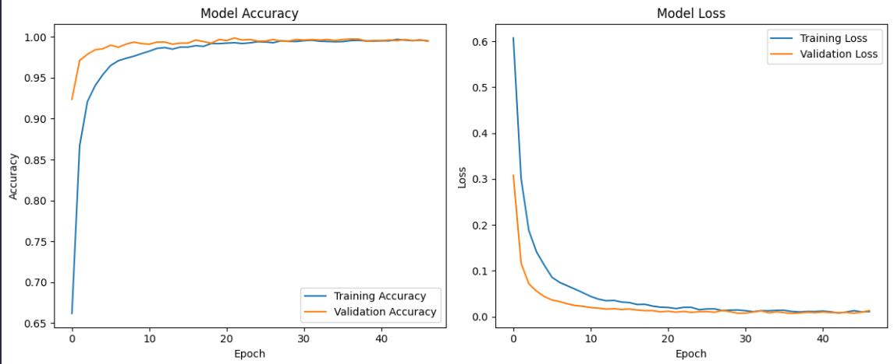
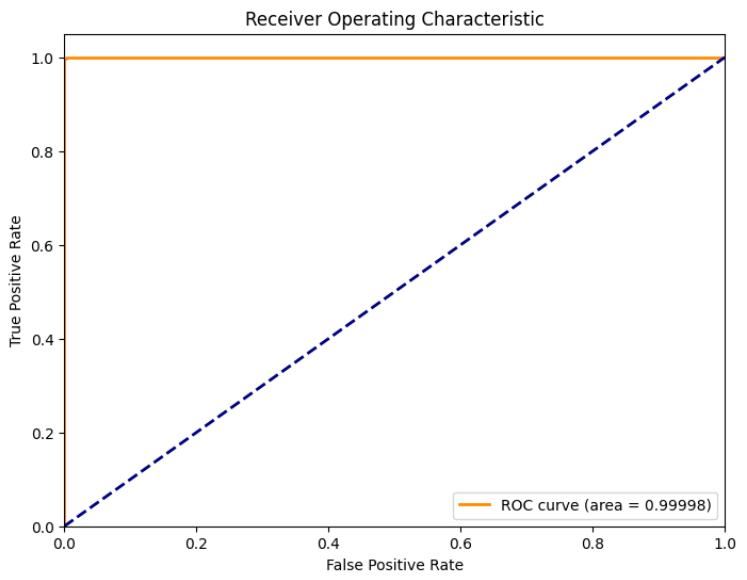
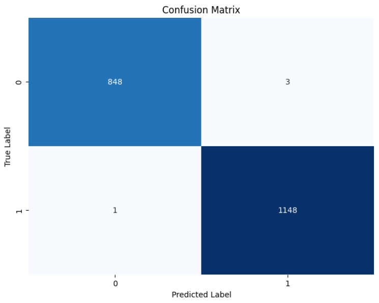

# Diabetes Prediction using AI Model

## Overview
This project involves building an AI model to predict diabetes based on input features. The model achieves a very high accuracy of **99.80%** after training and evaluation.

## Results

### Model Accuracy and Loss



- **Left**: Model Accuracy per Epoch
- **Right**: Model Loss per Epoch

### ROC Curve



- ROC AUC Score: **0.99998**

### Confusion Matrix



- True Negatives: 848
- False Positives: 3
- False Negatives: 1
- True Positives: 1148

## How to Run

1. Clone this repository:
   ```bash
   git clone https://github.com/ReaalSATYAM/Diabetes_Predictor.git
   ```

2. Run the Jupyter Notebook:
   ```bash
   jupyter notebook main.ipynb
   ```

## Dataset
The model was trained on a diabetes dataset containing medical predictor variables and one target variable (diabetes or not),
[Dataset](https://www.kaggle.com/datasets/marshalpatel3558/diabetes-prediction-dataset?resource=download).

## Technologies Used
- Python
- TensorFlow / Keras
- NumPy
- Pandas
- scikit-learn
- Matplotlib
- Seaborn

## Conclusion
The AI model successfully predicts diabetes with very high accuracy, low loss, and excellent generalization capability. The confusion matrix and ROC curve demonstrate that the model is highly reliable for practical use.

---
# Contact Information
[](https://www.linkedin.com/in/satyam-naithani-sss/)
[](https://github.com/ReaalSATYAM)


